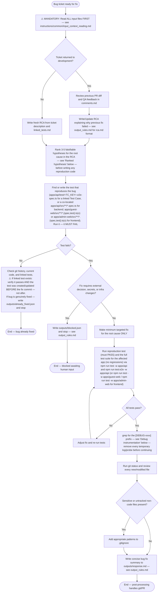

## Returning from test-automation failure

When this Bug has been sent back to development because a linked Test Case failed:

1. Read the `Failed Reason` field of every linked Test Case.
2. If the failure is caused by a missing token, missing permission, missing secret, or any other access/credential/infra issue that you cannot fix in product code, write `outputs/blocked.json` and stop. Do **not** try to code a fix for an access problem.
3. Only attempt a product-code fix when the failure is a genuine product regression.

## Ranked hypotheses — before writing any reproduction code

Jumping straight from the ticket description to a reproduction test anchors
on whatever cause looks most obvious first. Before touching code or writing
the reproduction test, add a short "Hypotheses" list to the RCA with 3-5
**ranked, falsifiable** candidate root causes:

> Format: "If `<X>` is the cause, then `<changing Y>` will make the bug
> disappear / `<changing Z>` will make it worse."

If a candidate can't be phrased as a testable prediction, it's a guess, not
a hypothesis — sharpen it or drop it. Use the ticket, `comments.md`, and
`linked_tests.md` to rank them (e.g. a recently changed file from the diff
history outranks an untouched one). The reproduction test in the next step
should target the top-ranked hypothesis first; if it doesn't reproduce the
bug, that's a falsified hypothesis — move to the next one and say so in the
RCA rather than silently pivoting.

## Debug instrumentation

Any temporary log, `console.log`/`Logger.debug` call, or probe added while
narrowing down the cause must be tagged with a unique prefix, e.g.
`[DEBUG-a4f2]`. This makes cleanup mechanical: before finishing, `grep -rn
"\[DEBUG-" <changed files>` and remove every match. An untagged debug log
left behind is indistinguishable from an intentional one and will surface as
a review finding — tag everything temporary as you add it, not retroactively
at the end.
