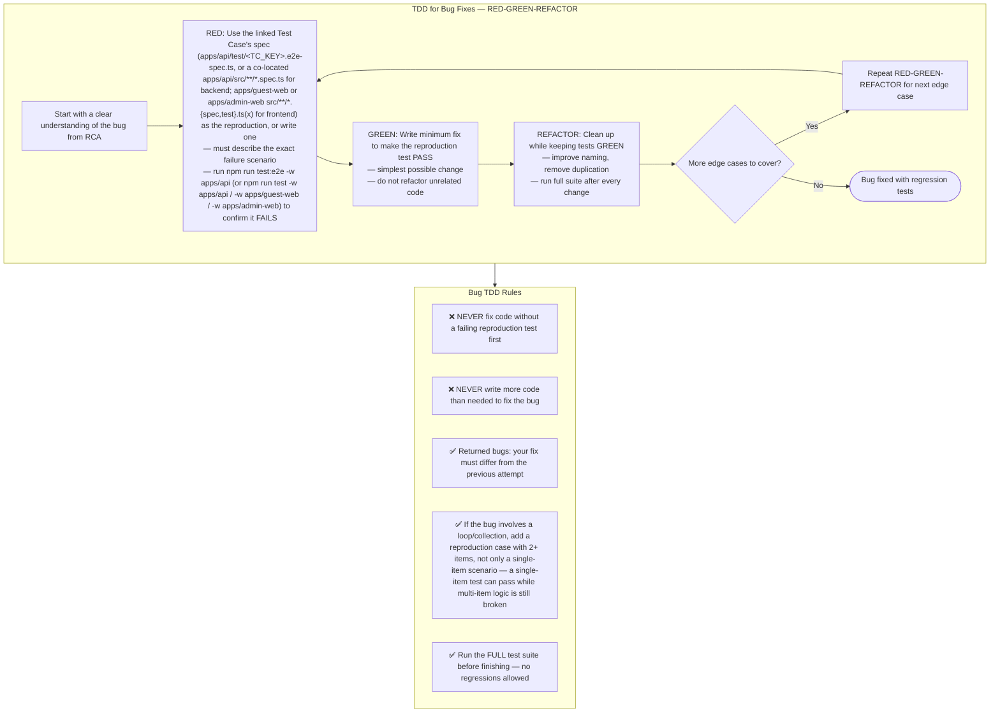

## Choosing what to fake — dependency categories

When the reproduction test needs a double for something the buggy code
depends on, pick it by what that dependency actually is — don't default to
mocking everything:

| Dependency kind | Example in bonapp | What to use in the reproduction test |
|---|---|---|
| **In-process** — pure computation, in-memory state | pricing math, cart totals, DTO mapping | No double needed — call the real function |
| **Local-substitutable** — has a real local stand-in | Postgres via `PrismaService` | Run against the real local Postgres in the test setup — not a mock of `PrismaService` |
| **Remote but owned** — our own service across a network boundary | internal WebSocket/BullMQ jobs between `apps/api` modules | Test through an in-memory adapter of the same port the production code depends on |
| **True external** — third party we don't control | Оплати, ЕРИП/bePaid, СКНО fiscal gateway, iiko/r_keeper | A mock/stub of that gateway's client is correct here |

Mocking a **true external** dependency is fine. Mocking your own internal
collaborator instead (e.g. mocking `PaymentService` instead of calling the
real one and only faking the external gateway client it wraps) hides the bug
behind the mock — the reproduction test can pass while the actual bug is
still there.
