```mermaid
flowchart TD
    subgraph INPUTS["Inputs"]
        I1["input/request.md — raw ticket description"]
        I2["input/existing_epics.json — {epics: [{key, summary, description, priority, diagrams, parent}]}"]
        I3["input/existing_stories.json — {stories: [{key, summary, status, priority, diagrams, parent}]}"]
    end

    subgraph TASK["Task"]
        T1["Read existing_epics.json & existing_stories.json fully"]
        T2["Analyze raw request — intent, themes, deliverables"]
        T3["Write description files"]
        T3a["Epics → outputs/stories/epic-N.md"]
        T3b["Stories → outputs/stories/story-N.md"]
        T3c["Structure: Goal → Scope → Out of scope → Notes<br/>⚠️ Use generic placeholder tags (see formatting_rules.md), NEVER raw Markdown — transform via tracker markup table before writing"]
        T4["Write outputs/stories.json — valid JSON array"]
        T5["Write outputs/comment.md — tracker-formatted summary"]
        T6["Bug request → type Bug, bug-N.md, no Epics/Stories"]
        T7["Too vague → explain in comment.md, write [] to stories.json"]
    end

    subgraph E2E["E2E User Journey Check"]
        E1["Entry point — clear homepage?"]
        E2["Navigation — reachable without direct URL?"]
        E3["App Shell — shared layout?"]
        E4["Auth gates — login vs public clear?"]
        E5["Happy path — core workflow complete end-to-end?"]
    end

    subgraph RULES["Rules"]
        R1["Validate JSON before finishing"]
        R2["Do not invent tracker keys"]
        R3["Check existing_stories.json to avoid duplicates"]
        R4["Summaries: concise, actionable, imperative"]
        R5["Stories: 1-2 sprints worth, split if needed"]
        R6["NO code, only analysis & structured content"]
        R7["Stories MUST be Testable: if autotest/integration coverage isn't realistic, don't create a separate story OR explicitly state 'no integration testing required — must be skipped, no test cases required, prerequisite story' (unit tests still required)"]
        R8["For existing/already-implemented features: verify they work correctly end-to-end AND are fully test-covered — code presence alone is not completion; gaps become their own Bug/Story"]
        R9["If the project defines an authoritative reference/target specification for scope (reference platform codebase, design spec, or PRD), that reference — not what the current codebase already appears to have — is the sole source of truth for decomposition. Existing code that merely looks similar to a reference feature is NEVER evidence that feature is done — always create/keep the story for that feature so a downstream dev/verification agent independently confirms real completeness. If the project has its own planning/tracking artifacts recording per-story/per-epic status and deferred/stubbed work (e.g. a sprint-status file, a deferred-work log, per-story files), treat their recorded status as ground truth and cross-check every 'already implemented' claim against them before asserting a feature works"]
        R10["NEVER create an Epic with zero child Stories in the same run. Every new Epic MUST be created together with at least its first actionable Stories in this same run — an Epic without Stories is not a valid output. If an Epic's full scope is too large to fully decompose in one pass, still create as many Stories as are known/actionable now, and explicitly list the remaining not-yet-decomposed slices in the Epic's own description Notes section — never leave the Epic itself as an empty placeholder"]
        R11["Before writing any description .md file: replace every generic placeholder tag with the tracker-specific markup from the transform table for this run's tracker (e.g. `agents/instructions/tracker/jira_markup_transform.md` for Jira). Never write literal placeholder tags or raw Markdown headings/bullets straight into a tracker description — same rule as `story_questions`"]
        R12["existing_epics.json / existing_stories.json are freshly fetched from the live tracker THIS run and are the SOLE authoritative record of which tickets currently exist. Never treat a key mentioned only in comments.md / a prior run's summary / memory as still existing if it's absent from these freshly fetched files — it may have been deleted. If they seem inconsistent with a prior comment, the fresh files are correct; do not rationalize the mismatch as an 'environment quirk' and fall back to stale text. Confirm every parent/blockedBy/integrates key against these files before use"]
        R13["Wide refactors are the exception to R5's vertical slicing. A wide refactor is one mechanical change (rename a column, retype a symbol in packages/shared-types) whose blast radius fans across the whole monorepo, so no single vertical slice can land green — see 'Wide refactors' below for how to decompose it instead"]
    end

    INPUTS --> TASK
    TASK --> E2E
    E2E --> RULES
```

## Wide refactors — expand/migrate/contract instead of vertical slices

Most work decomposes into vertical slices (each Story cuts a narrow but
complete path through schema/API/UI/tests, demoable on its own). A **wide
refactor** doesn't fit that shape: one mechanical change — renaming a
Prisma column, retyping a symbol in `packages/shared-types` that every
`apps/*` imports, changing a shared `tenantId` convention — has a blast
radius spanning the whole monorepo. Forcing R5's "1-2 sprints, split if
needed" onto it produces Stories that can't individually stay green, because
the old and new forms can't coexist mid-slice.

Sequence it as three Story types instead, wired together with the existing
`blockedBy` field (`formatting_rules.md`):

1. **Expand** — one Story that adds the new form beside the old (new column
   alongside the old one, new type alongside the old one) without removing
   anything. Nothing breaks; this Story has no `blockedBy`.
2. **Migrate batches** — one Story per package/directory/app that moves call
   sites from the old form to the new one, sized so each batch's tests stay
   green on its own. Each migrate Story sets `blockedBy: [<expand tempId>]`.
   Batches may run in parallel (they don't block each other) unless they
   touch overlapping files.
3. **Contract** — one Story that deletes the old form once no caller remains.
   Its `blockedBy` lists every migrate batch Story's `tempId`/key.

State in the Epic's Notes (or the expand Story's Notes, if there's no Epic)
that this is an expand-contract sequence and name the batches, so a reader
doesn't mistake the narrow expand Story for the whole refactor.
