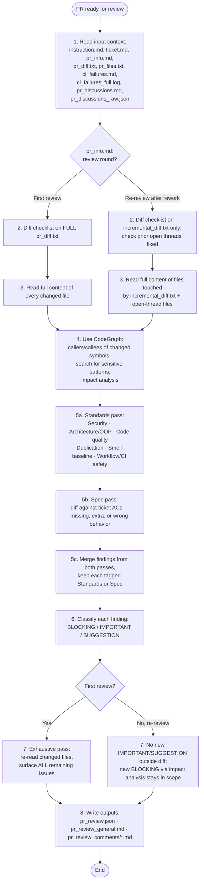
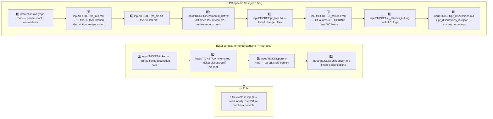

# PR Review General Guidelines

## Review flow



## 1. Input context — MANDATORY reading order



Read PR files to understand WHAT changed. Read ticket files to understand WHY it changed and verify against requirements.

## 2. Diff checklist — apply to `pr_diff.txt` (first review) or `incremental_diff.txt` (re-review, see §7)

For every hunk, ask at least these questions:

- [ ] Does the change match the ticket scope? Any scope creep?
- [ ] Are new or changed public APIs contract-safe for existing callers?
- [ ] Is user/external input validated, sanitized, or escaped?
- [ ] Are secrets, tokens, or PATs handled safely — not logged, not interpolated into shell scripts?
- [ ] Are new or modified files present under `testing/` in a non-test-automation PR?
- [ ] Is dead code, unused imports, or obvious duplication introduced?
- [ ] Are error paths handled, or are failures silently swallowed?
- [ ] Are new dependencies justified and compatible with the existing stack?
- [ ] Beyond blockers: what other maintainability, correctness, or quality improvements are visible in the changed code?

## 3. Changed-file deep read

Do not review from the diff alone. On a first review, read the full content of every changed file. On a re-review, read the full content of every file touched by `incremental_diff.txt` (full file, not just the hunk — surrounding context matters), plus any file with a still-open thread from §7:

- imports and dependencies
- class/method responsibilities and adherence to SRP / OOP principles
- naming consistency with the rest of the codebase
- error handling, logging, and edge cases
- test coverage for changed behavior
- backward-compatibility and migration impact

## 4. Impact analysis (CodeGraph or grep fallback)

**Always run this step, on both a first review and a re-review — it is not exempted by §7's incremental scoping.** §7 limits which code gets *new style/maintainability findings*; it never limits the blast-radius check. A rework commit can introduce a BLOCKING regression in a file the diff never touches (e.g. it changes a function's contract and an untouched caller still assumes the old one) — that regression is only visible from this step, not from reading `incremental_diff.txt` in isolation.

Use CodeGraph to find "what could break":

- `codegraph_callers` / `codegraph_callees` on modified public symbols — on a re-review, run this on every symbol touched by `incremental_diff.txt`, and follow callers even into files outside the diff
- `codegraph_search` for: `PAT_TOKEN`, `secrets.`, `github.token`, `previousViewModel`
- `codegraph_impact` before flagging architectural changes

If this surfaces a real BLOCKING regression in a file `incremental_diff.txt` doesn't cover, it is always in scope regardless of review round — file it as `outputs/pr_review_general.md` (not an inline comment, since the affected line isn't in the diff) and say explicitly which changed symbol caused it.

**If CodeGraph unavailable**, use grep and document it:
```bash
grep -rn "changedFunctionName" --include="*.ts" .
grep -rn "secrets\.\|github\.token" .
```

## 5. Review dimensions — two axes, run as separate passes

Run **Standards** and **Spec** as two distinct passes over the same diff. Do not
interleave them into one mental pass — a change can pass one axis and fail the
other (code that follows every convention but implements the wrong thing, or
code that does exactly what the ticket asked but breaks project conventions).
Tag every finding with its axis (`Standards` or `Spec`) so the two never get
reranked against each other; a BLOCKING Spec gap does not excuse skipping a
BLOCKING Standards issue, and vice versa.

### 5a. Standards pass

Does the diff conform to this repo's documented conventions (`instruction.md`,
linter/formatter config, existing patterns in sibling files)?

| Dimension | What to check |
|---|---|
| **Security** | injection, unsafe interpolation, secret leakage, missing permissions, unsafe defaults |
| **Architecture / OOP** | SRP, coupling, abstraction consistency, provider/repository boundaries |
| **Code quality** | naming, complexity, error handling, logging, comments |
| **Tests** | coverage for new/changed paths, meaningful assertions, no brittle string-only tests |
| **Duplication** | copy-paste, duplicated logic across files, duplicated configuration |
| **Backward compatibility** | public API changes, migration paths, default behavior |
| **Performance** | unnecessary rebuilds, heavy sync operations, missing timeouts |
| **Workflow / CI safety** | (when `.github/workflows/` changes) secret declarations, ref pinning, permissions, timeouts |

**Smell baseline** — on top of whatever the repo documents, always check the
diff against this fixed set of Fowler code smells (*Refactoring*, ch.3). Each
smell is a labelled heuristic, never a hard violation: a documented repo
convention always overrides the baseline, and skip anything already enforced
by lint/formatter tooling.

| Smell | What it looks like | Fix direction |
|---|---|---|
| **Mysterious Name** | name doesn't reveal what it does or holds | rename; if no honest name comes, the design's murky |
| **Duplicated Code** | same logic shape in more than one hunk/file | extract the shared shape |
| **Feature Envy** | method reaches into another object's data more than its own | move the method onto the data it envies |
| **Data Clumps** | same few fields/params keep travelling together | bundle into one type |
| **Primitive Obsession** | a primitive/string standing in for a domain concept | give the concept its own small type |
| **Repeated Switches** | same switch/if-cascade on the same type recurs | polymorphism, or one shared map |
| **Shotgun Surgery** | one logical change forces scattered edits across many files | gather what changes together into one module |
| **Divergent Change** | one file/module edited for several unrelated reasons | split so each module changes for one reason |
| **Speculative Generality** | abstraction/params/hooks added for needs the spec doesn't have | delete it; inline back until a real need shows |
| **Message Chains** | long `a.b().c().d()` navigation the caller shouldn't depend on | hide the walk behind one method |
| **Middle Man** | a class/function that mostly just delegates onward | cut it, call the real target direct |
| **Refused Bequest** | subclass/implementer ignores or overrides most of what it inherits | drop the inheritance, use composition |

Cite hard violations (documented standard + rule) separately from smell
judgement calls (name the smell, quote the hunk) — hard violations can justify
a higher severity by themselves, smells are advisory unless they compound into
a real risk.

### 5b. Spec pass

Does the diff faithfully implement what `ticket.md` (ACs) and any linked
spec/confluence doc asked for? Check, independently of the Standards pass:

- requirements the ticket asked for that are missing or partially done
- behavior in the diff that wasn't asked for (scope creep)
- requirements that look implemented but where the implementation looks wrong
  against the stated AC

Quote the specific AC or ticket line for each Spec finding.

## 6. Severity classification

Classify every finding before writing outputs:

- **BLOCKING** — merge would cause a bug, security issue, data loss, or CI break. Must be fixed.
- **IMPORTANT** — real maintainability or correctness issue. Strongly prefer fixing before merge.
- **SUGGESTION** — optional improvement, style, or future polish. Does not block merge.

When in doubt, start one level higher; downgrade only after confirming the risk is negligible.

## 7. First review vs. re-review — scope discipline

`pr_info.md` states the **review round** at the bottom (written by the setup step):

- **"First review on this PR"** → this is a fresh, exhaustive pass. Review the entire `pr_diff.txt`. Everything in this document (checklist, deep-read, dimensions, exhaustive pass) applies at full scope. Aim to surface the maximum number of actionable findings — the author will not get a cheaper chance to catch what's missed here.

- **"Re-review after rework — last reviewed commit `<sha>`"** → a previous round of this same review already covered the code as it stood at `<sha>`. This round exists to check the fix and its consequences, not to re-litigate style/maintainability calls already made on unchanged code:
  - Read `incremental_diff.txt` (diff from `<sha>` to the current head) as the primary object of review. This is what actually changed since last time.
  - Cross-check `pr_discussions.md` / `pr_discussions_raw.json`: for every previously open BLOCKING/IMPORTANT thread, don't just check that *something* changed nearby — verify the current code actually removes the failure scenario the thread described. A rename, a comment, or a partial fix that leaves the same bug reachable through a slightly different path is **not** a fix: re-raise it. Only put a thread in `resolvedThreadIds` when you can state why the original failure scenario can no longer happen.
  - Run §4 impact analysis on every symbol `incremental_diff.txt` touches — this is not optional on a re-review (see §4). A new BLOCKING issue anywhere this analysis reaches — inside or outside `incremental_diff.txt` — is always in scope, since it is a consequence of the rework itself.
  - **Do not open new IMPORTANT/SUGGESTION findings on code the rework didn't touch and §4 impact analysis doesn't implicate**, purely from re-reading the full `pr_diff.txt` and noticing something imperfect that was already there last round. That code already passed (or was accepted at) the prior round; re-flagging pre-existing imperfections on every rework cycle is exactly the churn this rule exists to stop. New BLOCKING findings are never suppressed by this rule, wherever they're found — severity, not location, is what §7 restricts.
  - If `incremental_diff.txt` says "No new commits since the last reviewed commit" but the ticket was sent for re-review anyway, re-check only the previously flagged threads against the current code — do not perform a fresh full-PR pass.
  - If `incremental_diff.txt` is missing even though `pr_info.md` says this is a re-review (setup could not compute it — e.g. history was rewritten by a force-push), fall back to a full `pr_diff.txt` pass as if it were a first review, and say so in `generalComment`.

The goal: every BLOCKING/IMPORTANT issue is raised the first time the code that has it is seen, and stays raised until actually fixed — including regressions the fix itself introduces, wherever they surface. What §7 stops is re-opening SUGGESTION/IMPORTANT-level style and maintainability debate on code nobody touched and nothing implicates, purely because it's being looked at again.

## 8. Outputs

Write the standard review artifacts:

- `outputs/pr_review.json` — structured data with `recommendation`, `summary`, `inlineComments`, `issueCounts`
- `outputs/pr_review_general.md` — 1-2 paragraph general PR comment, with the
  Spec-axis findings (if any) called out separately from Standards-axis
  findings — don't merge them into one undifferentiated list
- `outputs/pr_review_comments/*.md` — one file per detailed inline comment.
  Start each comment with its axis tag, e.g. `**[Spec]**` or
  `**[Standards]**`, so the author knows which question it answers

**Inline comment lines must be present in the full PR diff (`pr_diff.txt`), even on a re-review.** GitHub review threads can only be attached to added or context lines inside a diff hunk against the base branch — `incremental_diff.txt` only scopes *which* findings to look for, it is never what a comment line number is validated against. If `pr_diff.txt` is truncated, run `git diff origin/{baseBranch}...HEAD` to locate the correct line numbers. Findings on unchanged code outside the diff belong in `outputs/pr_review_general.md`, not as inline comments.

Do NOT write `outputs/response.md`; the review is posted to GitHub only.
