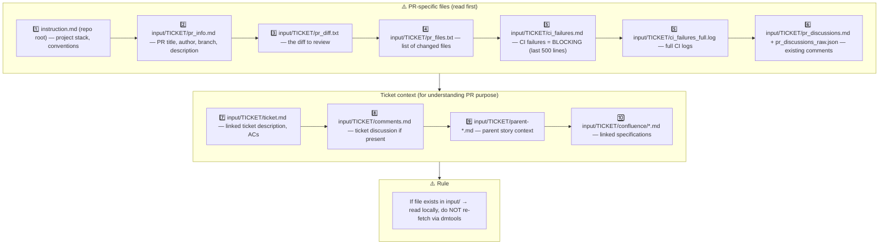

```mermaid
flowchart TD
    START([Ticket enters rework]) --> SETUP{rework_setup_failed.md exists?}
    SETUP -->|Yes| FAIL[Write setup failure response and stop]
    SETUP -->|No| INPUT[Read ALL input files in the ticket subfolder]
    INPUT --> INPUTS["request.md, comments.md, existing_questions.json, parent_context_*.md, pr_info.md, pr_diff.txt, merge_conflicts.md, ci_failures.md, ci_failures_full.log, pr_discussions.md, pr_discussions_raw.json"]
    INPUTS --> CONFLICTS{merge_conflicts.md exists?}
    CONFLICTS -->|Yes| RESOLVE["Resolve every conflict marker by INTENT, not mechanically<br/>— see 'Resolving merge conflicts' below —<br/>git add each file, verify with git diff --check"]
    RESOLVE --> POSTRESOLVE["Run lint/typecheck/tests on files touched by the resolution<br/>— a conflict fix can break what CI or the other side already fixed"]
    CONFLICTS -->|No| CI
    POSTRESOLVE --> CI{ci_failures.md or ci_failures_full.log exists?}
    CI -->|Yes| FIX_CI["Fix CI root cause: dependencies, config, or test setup"]
    CI -->|No| THREADS
    FIX_CI --> THREADS[Address every open thread in pr_discussions.md]
    THREADS --> BLOCKING{BLOCKING issues?}
    BLOCKING -->|Yes| FIX_BLOCK["Fix BLOCKING first — security, critical bugs"]
    FIX_BLOCK --> IMPORTANT
    BLOCKING -->|No| IMPORTANT[Fix IMPORTANT issues]
    IMPORTANT --> SUGGESTIONS{Minor suggestions?}
    SUGGESTIONS -->|Yes| SKIP["Skip if time-consuming — note in response.md"]
    SUGGESTIONS -->|No| TEST["Follow TDD approach for every fix — see tdd_approach.md — then run tests and verify"]
    SKIP --> TEST
    TEST --> BLAST["Blast-radius check — see verification_gate.md:<br/>global providers, schema/index changes,<br/>public signatures, migrations"]
    BLAST --> GATE["⚠️ Verification gate — see verification_gate.md:<br/>npm run lint && npm run typecheck && npm test"]
    GATE --> PASS{All green?}
    PASS -->|No| FIXROOT["Fix the root cause — never disable a rule<br/>or weaken a test to pass"] --> GATE
    PASS -->|Yes| OUTPUT[Write outputs/response.md]
    OUTPUT --> REPLIES{Open review threads?}
    REPLIES -->|Yes| REVIEW_REPLIES["Write outputs/review_replies.json with one reply per open thread using threadId + inReplyToId"]
    REPLIES -->|No| END([End])
    REVIEW_REPLIES --> END
```

## 1. Input context — MANDATORY reading order

Read PR files to understand WHAT changed. Read ticket files to understand WHY it changed and verify against requirements.

## 2. Resolving merge conflicts — by intent, not mechanically

`merge_conflicts.md` tells you a conflict exists; it does not tell you which
side is right. Treat each conflict marker as two competing intents, not just
two strings:

1. **Find the primary source for each side.** Read the commit message that
   introduced each conflicting hunk (`git log -1 --format=%B <sha>` for both
   sides), and, when available, the PR description or linked ticket for the
   side that isn't this rework's own branch. Understand *why* each change was
   made before touching either one.
2. **Resolve each hunk to preserve both intents where possible.** Most
   conflicts are two independent changes touching nearby lines — merge them
   so both survive, don't default to "take theirs" or "take ours."
3. **Where the two are genuinely incompatible**, pick the version that matches
   this PR's stated goal (the ticket/`request.md`), and say so explicitly
   under `## Issues/Notes` in `outputs/response.md` — name the trade-off,
   don't silently drop the other side's intent.
4. **Never invent new behavior** to paper over a conflict, and never
   `git merge --abort` / `git rebase --abort` to sidestep it — always resolve
   forward.
5. **After resolving, run the affected checks immediately** (lint/typecheck/
   the specific test files touched by the resolution), not just at the final
   verification gate — a conflict resolution can silently revert a fix that
   CI or the other branch already made, and catching that here is cheaper
   than catching it at the full gate or in the next review round.
