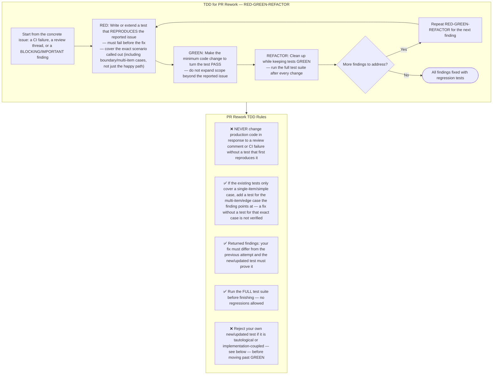

## Test-quality gate — every new or updated test must pass this before GREEN counts

A test that passes by construction, or that breaks on refactors with no
behavior change, is not a regression test — it gives false confidence that
the finding is fixed. Before treating a test as done, check it against both
failure modes:

**Tautological test** — the expected value is computed the same way the
production code computes it, so the test can't fail even if the logic is wrong.

```typescript
// BAD — expected is recomputed the way the code computes it
const expected = items.reduce((sum, i) => sum + i.price, 0);
expect(calculateTotal(items)).toBe(expected);

// GOOD — expected is an independent, known literal
expect(calculateTotal([{ price: 10 }, { price: 5 }])).toBe(15);
```

**Implementation-coupled test** — the test reaches into internals (mocked
collaborators, private methods, call-count assertions, direct DB queries)
instead of going through the public interface/seam the caller actually uses.

```typescript
// BAD — mocks an internal collaborator, asserts on call shape not behavior
const mockPayment = jest.mock(paymentService);
await checkout(cart, payment);
expect(mockPayment.process).toHaveBeenCalledWith(cart.total);

// BAD — bypasses the service interface to verify via a side channel
await createUser({ name: "Alice" });
const row = await db.query("SELECT * FROM users WHERE name = ?", ["Alice"]);
expect(row).toBeDefined();

// GOOD — verifies through the same interface a real caller uses
const user = await createUser({ name: "Alice" });
const retrieved = await getUser(user.id);
expect(retrieved.name).toBe("Alice");
```

If a new/updated test has either red flag, rewrite it against the public
seam before finishing this finding — do not proceed to REFACTOR with a test
that only proves the code equals itself.

## Choosing what to fake — dependency categories

The implementation-coupled check above says "go through the public interface,"
but doesn't say what's on the other side of that interface during a test. Pick
the test double by what the fix's dependency actually is:

| Dependency kind | Example in bonapp | What to use in the test |
|---|---|---|
| **In-process** — pure computation, in-memory state | pricing math, cart totals, DTO mapping | No double needed — call the real function |
| **Local-substitutable** — has a real local stand-in | Postgres via `PrismaService` | Run against the real local Postgres in CI/test setup (or the project's existing test-DB pattern) — not a mock of `PrismaService` |
| **Remote but owned** — our own service across a network boundary | internal WebSocket/BullMQ jobs between `apps/api` modules | Test through an in-memory adapter of the same port the production code depends on, not a mock of the calling method |
| **True external** — third party we don't control | Оплати, ЕРИП/bePaid, СКНО fiscal gateway, iiko/r_keeper | A mock/stub of that gateway's client is correct here — this is the one case where mocking is the right call, not a red flag |

Mocking a **true external** dependency is not what the implementation-coupled
check above forbids — that check is about mocking your own internal
collaborators to dodge testing real behavior. Mocking Оплати's HTTP client is
correct; mocking your own `PaymentService` to avoid calling the real one that
wraps it is the anti-pattern.
