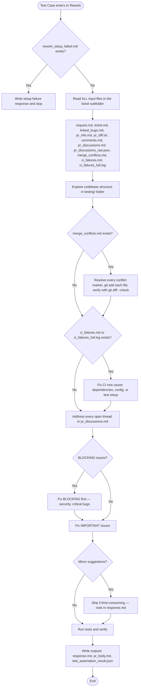

## PR-wide rework contract

The ticket that triggered this agent is only the coordinator for a shared test PR.
Do not limit the fix to that ticket's spec file. Read `pr_discussions.md`,
`pr_discussions_raw.json`, `pr_diff.txt`, and CI failure files as PR-wide inputs and:

- fix every open BLOCKING/IMPORTANT thread across all Test Case files in the PR;
- apply the same correction to repeated instances of the same defect;
- resolve or explicitly reply to every addressed thread in `outputs/review_replies.json`;
- run the relevant focused tests while editing; the post-action will additionally
  enforce repository-wide lint, typecheck, test, and build gates before publishing;
- do not report success while any known blocking thread or CI failure remains.
