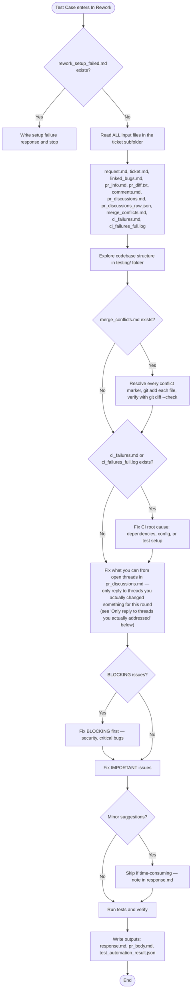

```mermaid
flowchart TD
    START([Test Case enters In Rework]) --> SETUP{rework_setup_failed.md exists?}
    SETUP -->|Yes| FAIL[Write setup failure response and stop]
    SETUP -->|No| INPUT[Read ALL input files in the ticket subfolder]
    INPUT --> INPUTS["request.md, ticket.md, linked_bugs.md, pr_info.md, pr_diff.txt, comments.md, pr_discussions.md, pr_discussions_raw.json, merge_conflicts.md, ci_failures.md, ci_failures_full.log"]
    INPUTS --> EXPLORE["Explore codebase structure in testing/ folder"]
    EXPLORE --> CONFLICTS{merge_conflicts.md exists?}
    CONFLICTS -->|Yes| RESOLVE["Resolve every conflict marker, git add each file, verify with git diff --check"]
    CONFLICTS -->|No| CI
    RESOLVE --> CI{ci_failures.md or ci_failures_full.log exists?}
    CI -->|Yes| FIX_CI["Fix CI root cause: dependencies, config, or test setup"]
    CI -->|No| THREADS
    FIX_CI --> THREADS["Fix what you can from open threads in pr_discussions.md —<br/>only reply to threads you actually changed something for this round<br/>(see 'Only reply to threads you actually addressed' below)"]
    THREADS --> BLOCKING{BLOCKING issues?}
    BLOCKING -->|Yes| FIX_BLOCK["Fix BLOCKING first — security, critical bugs"]
    FIX_BLOCK --> IMPORTANT
    BLOCKING -->|No| IMPORTANT[Fix IMPORTANT issues]
    IMPORTANT --> SUGGESTIONS{Minor suggestions?}
    SUGGESTIONS -->|Yes| SKIP["Skip if time-consuming — note in response.md"]
    SUGGESTIONS -->|No| TEST[Run tests and verify]
    SKIP --> TEST
    TEST --> OUTPUT[Write outputs: response.md, pr_body.md, test_automation_result.json]
    OUTPUT --> END([End])
```

## PR-wide rework contract

The ticket that triggered this agent is only the coordinator for a shared test PR.
Do not limit the fix to that ticket's spec file. Read `pr_discussions.md`,
`pr_discussions_raw.json`, `pr_diff.txt`, and CI failure files as PR-wide inputs and:

- fix every open BLOCKING/IMPORTANT thread across all Test Case files in the PR you can actually fix this round;
- apply the same correction to repeated instances of the same defect;
- resolve or explicitly reply to every thread you actually addressed this round in `outputs/review_replies.json`;
- run the relevant focused tests while editing; the post-action will additionally
  enforce repository-wide lint, typecheck, test, and build gates before publishing;
- do not report success while any known blocking thread or CI failure remains.

## Only reply to threads you actually addressed this round

`outputs/review_replies.json` must include **only** threads where this round's
changes actually did something about that thread's finding — a real code
change, a documented reason the finding doesn't apply, or an explicit,
justified skip. Do not include a thread just because it's open; a blanket
"reply to everything open" produces a "✅ Addressed." reply on threads
nothing was actually done for.

This matters concretely for a genuine product defect a Test Case correctly
caught (see `pr_test_automation_review`'s "Genuine defect → APPROVE"): if the
underlying product code hasn't changed, the thread's finding hasn't changed
either — replying "Addressed" on it every round is false, and the review
agent will (correctly) re-open the same finding, compounding into a
duplicate-reply spiral. Observed on PR #169: the same BNP-417 finding was
answered "✅ Addressed." dozens of times across rounds with no actual test or
product change behind most of those replies, growing past 700 PR comments.

If a thread's finding genuinely cannot be resolved from the test-automation
side (e.g. it needs a product fix, or a human decision on scope), say so
explicitly in `outputs/response.md` under a clear heading and leave that
thread out of `review_replies.json` rather than closing it with a reply that
doesn't reflect what happened.
