```mermaid
flowchart TD
    START([Story ticket ready for development]) --> READ_INPUT["⚠️ MANDATORY: Read ALL input files FIRST — see instructions/common/input_context_reading.md"]
    READ_INPUT --> PARENT["Read parent epic context if present:<br/>- input/TICKET/parent_context_ba.md — business rules<br/>- input/TICKET/parent_context_sa.md — technical design<br/>- input/TICKET/parent_context_vd.md — visual design"]
    PARENT --> ANALYZE["Analyze requirements — every acceptance criterion must be addressed"]
    ANALYZE --> ARCH["Understand existing codebase patterns, architecture, and test structure"]
    ARCH --> PRINCIPLES["Apply OOP principles: SRP, OCP, DI, Encapsulation, Composition over inheritance"]
    PRINCIPLES --> DEEPMOD["Deep-module check on any new class/provider/module:<br/>deletion test + one-vs-two-adapter rule — see below"]
    DEEPMOD --> TDD["Follow TDD approach — see tdd_approach.md"]
    TDD --> TEST_LOC["Write TDD tests in the standard unit-test tree only<br/>— Flutter/Dart: test/<br/>— NEVER in testing/ (owned by test-automation agents)"]
    TEST_LOC --> IMPLEMENT["Implement source code and unit tests following existing patterns"]
    IMPLEMENT --> DOCS["Update documentation ONLY if ticket explicitly requires it"]
    DOCS --> RUN["Run all unit tests — MUST pass before finishing"]
    RUN --> PASS{Tests pass?}
    PASS -->|No| FIX["Fix failures and re-run tests"]
    FIX --> RUN
    PASS -->|Yes| DIFFLIST["List new/modified source files only<br/>(e.g. git diff --diff-filter=ACM --name-only + git status --short for untracked)"]
    DIFFLIST --> LINT["Lint exactly those files<br/>(e.g. npx eslint &lt;changed-files&gt;, not the whole workspace) — MUST pass before finishing"]
    LINT --> LINTPASS{Lint passes, zero errors, on changed files?}
    LINTPASS -->|No| LINTFIX["Fix lint errors in changed files — auto-fixable ones via --fix, rest manually<br/>NEVER disable/suppress a rule to make it pass<br/>Pre-existing errors in untouched files are NOT your responsibility — do not fix or reformat them"]
    LINTFIX --> LINT
    LINTPASS -->|Yes| TYPECHECK["Run the project's typecheck command for the whole changed workspace<br/>(e.g. npm run typecheck --workspace=apps/api) — TypeScript has no reliable single-file mode,<br/>so this may surface pre-existing errors; only fix ones in files you touched"]
    TYPECHECK --> TYPEPASS{Typecheck introduces no NEW errors in your changed files?}
    TYPEPASS -->|No| TYPEFIX["Fix type errors in the files you changed — NEVER silence with `any`/`@ts-ignore` to make it pass<br/>Leave pre-existing errors in untouched files alone"]
    TYPEFIX --> TYPECHECK
    TYPEPASS -->|Yes| GITSTATUS["Run git status and review every new/modified file"]
    GITSTATUS --> SECRETS{Sensitive or untracked non-code files present?}
    SECRETS -->|Yes| IGNORE["Add appropriate patterns to .gitignore"]
    SECRETS -->|No| SUMMARY["Write concise PR description to outputs/response.md — see output_rules.md"]
    IGNORE --> SUMMARY
    SUMMARY --> END([End — post-processing handles branch, commit and PR])
```

## Deep-module check — before writing the new class/provider/module

Before implementing a new NestJS provider, service, or React module the
ticket calls for, check its planned shape against two questions — this is a
design step, not a post-hoc review comment:

- **The deletion test.** If you deleted this module and inlined it at its
  call site(s), would the complexity disappear (it's a pass-through — don't
  add it, inline the logic instead) or reappear at every caller (it's
  earning its keep — build it)?
- **One adapter means a hypothetical seam, two means a real one.** Don't
  introduce a new interface/port (an injectable abstraction with only one
  implementation) unless a second adapter is actually needed now — a test
  double counts as the second adapter only if the ticket or existing
  patterns actually call for isolating that dependency in tests (see
  dependency categories in `tdd_approach.md`). Otherwise depend on the
  concrete implementation directly and introduce the interface later, when
  a real second adapter shows up.

A large interface with many methods, or params that mostly just get passed
through unchanged, is a sign the module is shallow — before implementing,
ask whether the method count or parameter list can shrink.
