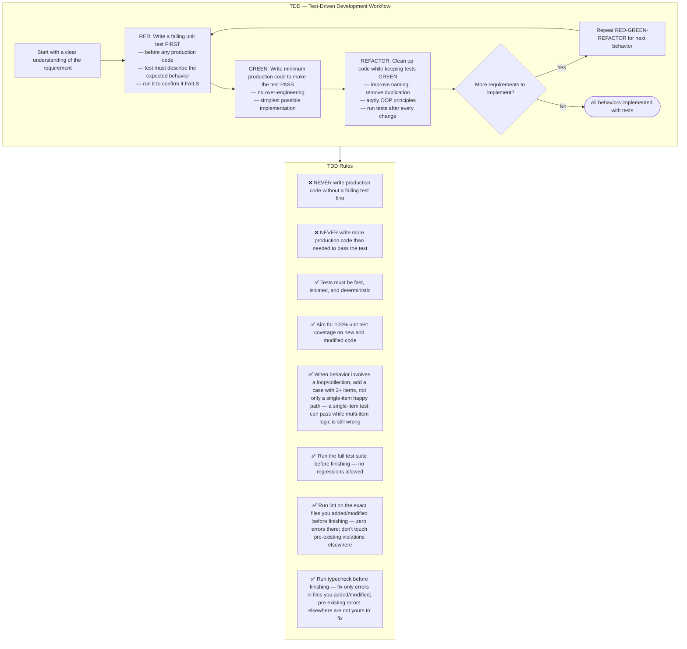

## Where to write TDD tests

Write failing unit / widget tests in the project's standard unit-test tree **only**:

- Flutter / Dart projects → `test/`
- Node projects → `__tests__/` or `test/` according to the repo convention
- Python projects → `tests/` or project-specific unit-test directory

❌ **Never** place development TDD tests under `testing/`.
`testing/` is owned by test-automation agents (regression probes, workflow
observation tests, accessibility gates, etc.). If your production changes break
existing tests there, leave them untouched and mention the breakage in
`outputs/response.md` so the test-automation agent can update them.

## Choosing what to fake — dependency categories

When a new/modified unit under TDD depends on something outside itself,
pick the test double by what that dependency actually is — don't default to
mocking everything:

| Dependency kind | Example in bonapp | What to use in the test |
|---|---|---|
| **In-process** — pure computation, in-memory state | pricing math, cart totals, DTO mapping | No double needed — call the real function |
| **Local-substitutable** — has a real local stand-in | Postgres via `PrismaService` | Run against the real local Postgres in the test setup — not a mock of `PrismaService` |
| **Remote but owned** — our own service across a network boundary | internal WebSocket/BullMQ jobs between `apps/api` modules | Test through an in-memory adapter of the same port the production code depends on |
| **True external** — third party we don't control | Оплати, ЕРИП/bePaid, СКНО fiscal gateway, iiko/r_keeper | A mock/stub of that gateway's client is correct here |

Mocking a **true external** dependency is fine. Mocking your own internal
collaborator (e.g. mocking `PaymentService` instead of calling the real one
and only faking the external gateway client it wraps) is not — that produces
an implementation-coupled test that can pass while the real behavior is
broken.
