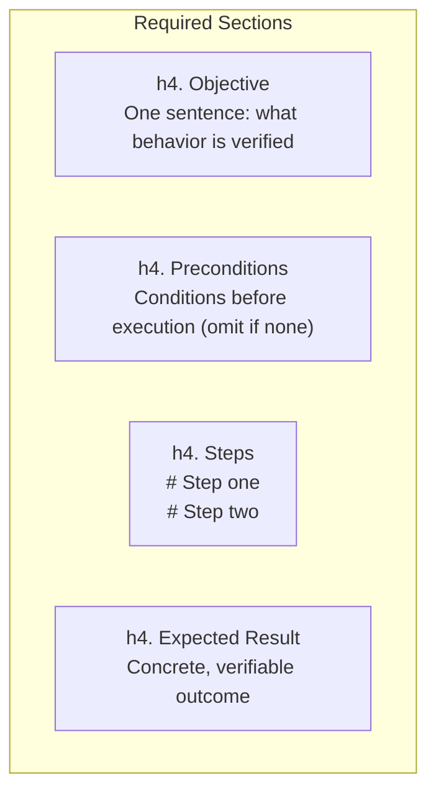
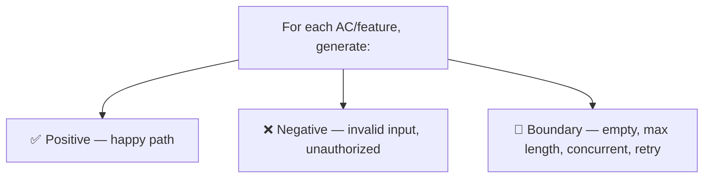
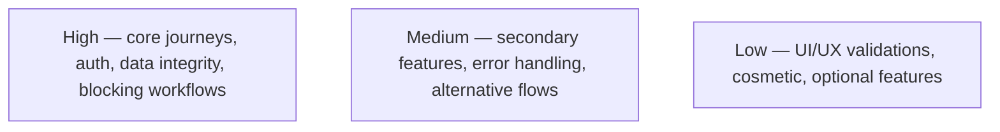
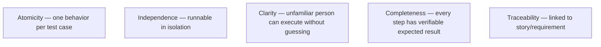
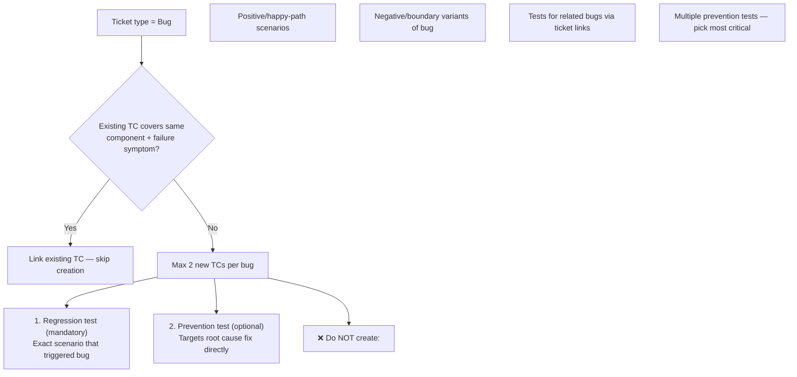
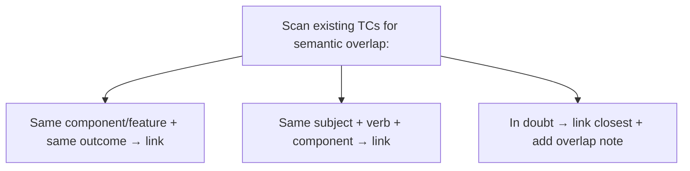

# Test Case Creation Rules

## Naming

Format: *Test: [Action or Feature] — [Expected Outcome]*

Examples:
- Test: Create Jira ticket via AI agent — ticket created with correct fields
- Test: Run agent with WIP label present — processing skipped, comment posted

## Structure

## Coverage

## Priority

## Quality Rules

## Scope

Cover:
- All acceptance criteria in the story
- Main integration points (tracker, SCM, AI providers)
- Error handling and failure scenarios
- Security-relevant behaviors (permissions, tokens, unauthorized access)

## Implemented-scope verification

Before creating a Test Case, distinguish between behavior delivered by the
current Story, behavior planned in another Story, and behavior that has no
explicit requirement or implementation evidence.

Binding rules:

- A Test Case MUST validate only behavior owned by the current Story.
- Never invent an endpoint path, HTTP method, status code, authentication
  mechanism, DTO, event, or UI control that is not explicitly stated in the
  Story or present in the merged implementation.
- If the Story delivers an internal service, middleware, database policy, or
  migration, test it at that layer. Do not turn it into an HTTP scenario unless
  the Story explicitly delivers the corresponding endpoint.
- Treat domain entities mentioned as examples (for example, orders or users)
  as test data. Mentioning an entity does not imply that its public API exists.
- If validation requires functionality owned by another unmerged Story, do not
  create that Test Case for the current Story. Report the dependency and
  recommend creating or linking the Test Case under the owning Story.
- Every generated Test Case must name its contract evidence in the creation
  summary: Story acceptance criterion, implemented file/symbol, or existing
  endpoint.

## Bug Test Cases — Strict Limits

## Deduplication (mandatory before creating)

