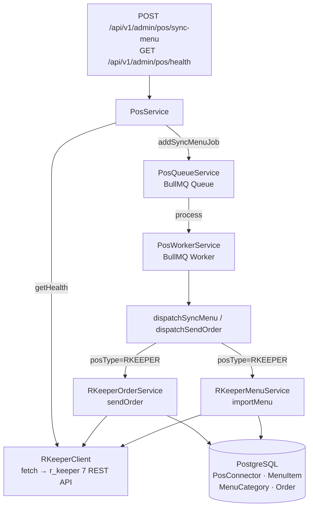

### Что изменилось

Реализован базовый коннектор r_keeper 7+ (REST/JSON API): импорт меню, асинхронная передача заказов в POS и health-check эндпоинт. Добавлены Prisma-модели для PosConnector, MenuCategory, MenuItem, Order, OrderItem.

### Ключевые решения

- **REST/JSON API r_keeper 7+** — XML-RPC не поддерживается (BNP-170)
- **`PosConnector` Prisma-модель** с уникальным ключом `(tenantId, posType)` для мультитенантности (BNP-171)
- **Мягкое скрытие** (`isAvailable = false`) позиций, пропавших из ответа r_keeper; вручную созданные позиции (без `posItemId`) не затрагиваются (BNP-172)
- **`RKeeperClientFactory`** — инжектируемый провайдер для создания HTTP-клиентов per-tenant; позволяет мокировать клиент в тестах без патча `fetch`
- **Единая BullMQ-очередь `pos`** с двумя типами задач (`sync-menu`, `send-order`); `PosWorkerService` читает из неё и диспатчит в нужный коннектор по `posType`
- **Fallback при ошибке POS**: заказ сохраняется в Bonapp даже если r_keeper недоступен; ошибка логируется, `posOrderId` не заполняется
- Basic Auth (`Authorization: Basic base64(user:pass)`) для r_keeper; поле `passwordEncrypted` в `PosConnector` — placeholder под шифрование на уровне приложения (KMS-слой не входит в объём истории)

### Как проверить

```bash
cd apps/api
npx jest --testPathPatterns="pos/" --no-coverage
# 36/36 tests pass
```

<details><summary>Архитектура</summary>



</details>
